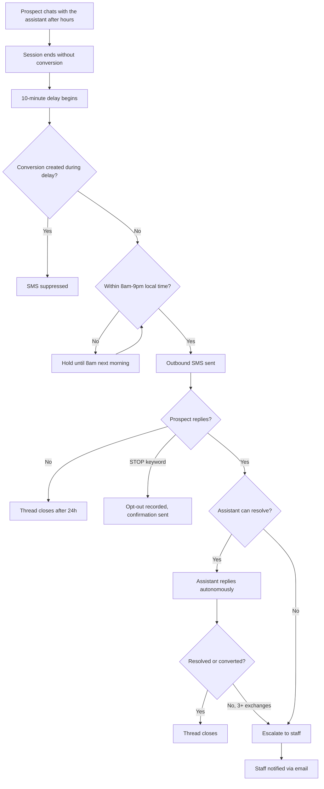

# Spec/PRD Creation Skill

## Purpose
Create comprehensive Product Requirement Documents (PRDs) that clearly define the business problem, scope, requirements, and success metrics for new features or products.

## When to Use This Skill
- Planning new product features or capabilities
- Defining multi-phase rollouts
- Aligning stakeholders on product direction
- Creating product rollout roadmaps

## PRD Structure

### 1. Business Problem
Clearly articulate:
- What problem are we solving?
- Who is affected by this problem?
- Why is this problem important now?
- What are the constraints or limitations of current solutions?

**Example:**
```
Admins and users currently have no way to manage notifications. 
This limits control over communication preferences and makes scaling new 
notifications or modalities cumbersome. We need a scalable notifications 
management framework that can grow over time while providing an intuitive 
UI for turning notifications on/off per modality.
```

### 2. Goals
Define what this feature must achieve in a concise table. Each goal should map to a measurable outcome so stakeholders can quickly understand what success looks like before reading detailed metrics.

**Format:**

| # | Goal | How We Measure It |
|---|------|-------------------|
| 1 | [Concrete outcome] | [Metric, target, and timeframe] |

**Example:**
```
| # | Goal                                          | How We Measure It                                         |
|---|-----------------------------------------------|-----------------------------------------------------------|
| 1 | Increase after-hours lead conversion rate      | +20% vs. baseline (control group) within 60 days          |
| 2 | Reduce staff time on manual follow-up          | 50% reduction in staff-initiated follow-up               |
| 3 | No compliance violations                       | Zero reported violations; 100% opt-out compliance          |
```

**Guidelines:**
- Keep to 3–6 goals (if you have more, some are likely success criteria, not goals)
- Each goal should be independently verifiable
- Goals describe *outcomes*, not *outputs* (e.g., "increase conversion" not "send SMS")

### 3. Non-Goals
Explicitly state what this version of the feature will NOT do. Each non-goal should include a short parenthetical rationale explaining why it's excluded — this prevents scope creep and aligns stakeholders on boundaries.

**Format:**
- **[Excluded capability].** *(Rationale for exclusion.)*

**Example:**
```
- **Outbound calls.** This is text only. *(Separate initiative with different 
  regulatory and operational complexity.)*
- **Multi-day follow-up sequences.** V1 is a single outbound text per session. 
  *(Prove the single-touch value first before building sequences.)*
- **MMS or rich media messages.** Plain SMS only. *(Simplicity for POC 
  validation; MMS introduces carrier/cost complexity.)*
```

**Guidelines:**
- Be specific — vague non-goals ("won't do everything") don't help
- Include the rationale so readers understand the tradeoff, not just the decision
- Distinguish between "never doing this" and "not in this version" (use "V2 consideration" language for the latter)

### 4. Assumptions
List all assumptions that must be true for the solution to work. Include:
- User permissions and roles
- Platform capabilities the experience relies on (stated as behavior: "the assistant can text callers")
- Business rules
- Dependencies on other products, vendors, or teams
- How the feature is expected to grow (markets, plans, user types)

**Format:**
- Start each assumption on a new line
- Be specific and testable
- Include rationale where helpful
- Distinguish between "must have" and "nice to have" assumptions

### 5. Success Criteria
Define measurable outcomes that indicate the feature is working as intended. Include:
- **Primary metrics:** Core business outcomes (user adoption, usage frequency, conversion rates)
- **Secondary metrics:** Supporting indicators (engagement, satisfaction, completion rates)
- **Experience quality:** Service levels the user can observe (delivery speed, reliability, visible error states)
- **Tracking requirements:** What must be measurable for the metrics above to be reportable

**Example:**
```
- Primary: Number of notifications fired off (system-wide and per account)
- Experience quality: Notifications arrive within 60 seconds, ≥ 98% of the time
- Tracking: Every notification is attributable to an account, user, and role
```

### 6. User Journey Flowchart
Include a flowchart that maps the complete end-to-end user journey before diving into detailed user stories. The purpose is to give every reader — product, engineering, design, stakeholders — a single picture of how a user moves through the feature from trigger to terminal state.

Use a mermaid flowchart. The chart should read like a story: it starts with the event that kicks things off, walks through each step the user (and system) takes, and ends at every possible terminal state (success, failure, opt-out, escalation, etc.).

**What to include:**
- The triggering event (what starts the journey)
- Each meaningful step the user or system takes, in order
- Decision points as diamond nodes with labeled branches (Yes/No, Success/Failure)
- All terminal states (conversion, escalation, opt-out, thread close, suppression)
- Delays or async handoffs (e.g., "10 min delay", "next morning")

**Example:**


**Guidelines:**
- Use `flowchart TD` (top-down) for journeys with many steps; `flowchart LR` (left-right) for simpler linear flows
- Start with the triggering event and end at every terminal state — don't leave dangling paths
- Show the happy path as the main vertical/horizontal spine; use branches for alternate outcomes
- Include system actions (not just user actions) — the flowchart shows what happens, not just what the user does
- Keep it to one flowchart per primary user role; if the feature has a distinct operator journey, add a second chart
- Do not try to capture every edge case — that's what the Functional Requirements table is for
- This flowchart should be the first thing a new reader looks at to understand the feature

### 7. Open Questions
Document unresolved issues that need stakeholder input:
- Product decisions requiring research or validation
- Business logic that needs clarification
- Edge cases to be defined
- Partner, vendor, or cross-team capabilities to be confirmed
- Prioritization questions

**Format:**
```
- What should the user see when a notification fails to send?
- Should users receive digest emails or real-time notifications?
- What happens when an account has 50+ users in this view?
- Do operators need to customize notification wording?
```

### 8. User Stories & Acceptance Criteria
For each user story, include:
- **Title:** Brief, descriptive name
- **As a [role]:** Who is this for?
- **I want [action]:** What do they want to do?
- **So that [benefit]:** Why do they want it?

**Acceptance Criteria Format:**
- Start with "When [trigger event]"
- List specific, testable outcomes
- Include user-visible performance expectations ("results appear within 2 seconds")
- Specify the error states the user can see and what they say
- Note what analytics/reporting the story must support
- Reference role-based access from assumptions

**Mark priority:**
- P0 (Must have for Phase 1)
- P1 (Should have)
- NICE TO HAVE (Future consideration)

### 9. Functional Requirements
Create a table mapping scenarios to expected outcomes:

| Scenario | Expected Outcome | Why | Notes |
|----------|-----------------|-----|-------|
| User action X | System does Y | Business rationale | Edge cases, dependencies |

**Guidelines:**
- Cover happy path and edge cases
- Include all user roles
- Specify timing requirements
- Note dependencies on other products, vendors, or teams

## No Technical Implementation Details

A PRD defines the problem, the experience, and the requirements — **never the implementation**.

**Do NOT include in a PRD:**
- Database schemas, tables, columns, or migrations
- API endpoints, GraphQL queries/mutations, or payload shapes
- Code, class names, function names, file paths, or module references
- Architecture diagrams, infrastructure, or framework choices
- Testing strategy (unit/integration test plans)

Technical design lives in the implementation plan (`/write-plan` → `.claude/plans/`), written
against the PRD after it's approved.

**The boundary rule:** if an engineering constraint shapes the product, state the
*user-visible behavior*, not the mechanism. ("Voice changes go live within a few
minutes" — not "voice writes enqueue the assistant rebuild background task.")

## Best Practices

### Writing Clear Requirements
- Use active voice
- Be specific about quantities and timing
- Define acronyms on first use
- Include examples where helpful
- Distinguish between "must have" and "nice to have"

### Organizing Multi-Phase Work
- Clearly label phase boundaries
- Explain what's in scope vs. out of scope for each phase
- Note what each phase must leave room for, stated as product capability ("V1 ships English-only but must not preclude per-account language later")
- Call out where a later phase changes the user experience of an earlier one

### Stakeholder Alignment
- Include all affected roles in user stories
- Link requirements to business metrics
- Provide rationale for product decisions
- Call out dependencies on other teams

### Maintaining PRDs
- Update open questions as they're resolved
- Add assumptions as they're discovered
- Version control the document
- Once an implementation plan exists (`.claude/plans/`), link to it — link out, never inline technical content

## Common Pitfalls to Avoid
- ❌ Vague success metrics ("improve user satisfaction")
- ❌ Missing edge cases in acceptance criteria
- ❌ Including technical implementation details (schemas, endpoints, code) — those belong in the implementation plan
- ❌ Forgetting to specify error states the user can see
- ❌ Not considering future extensibility
- ❌ Missing logging/analytics requirements

## Template Checklist
Before finalizing your PRD, verify:
- [ ] Business problem is clearly stated
- [ ] Goals are defined with measurable outcomes
- [ ] Non-goals are listed with rationale
- [ ] All assumptions are documented
- [ ] Success criteria are measurable and specific
- [ ] User journey visual covers the happy path and key branches
- [ ] Open questions are listed
- [ ] User stories cover all roles
- [ ] Acceptance criteria are testable
- [ ] Functional requirements table is complete
- [ ] No technical implementation details (schemas, endpoints, code, file paths, architecture)
- [ ] Engineering constraints expressed as user-visible behavior, not mechanisms
