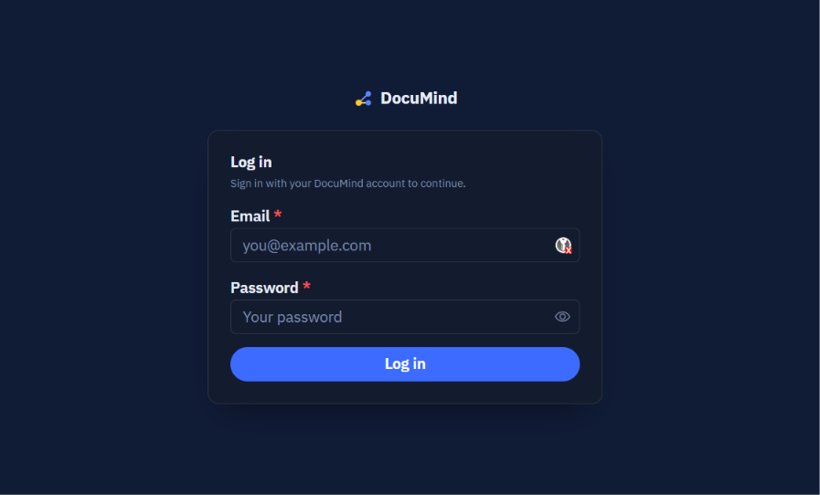
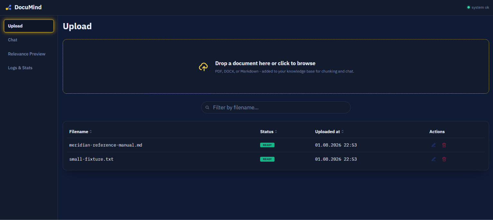
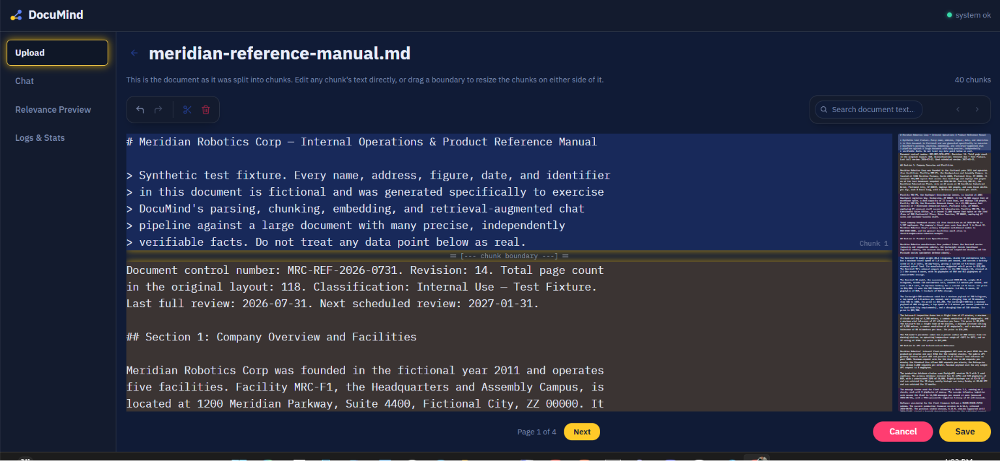
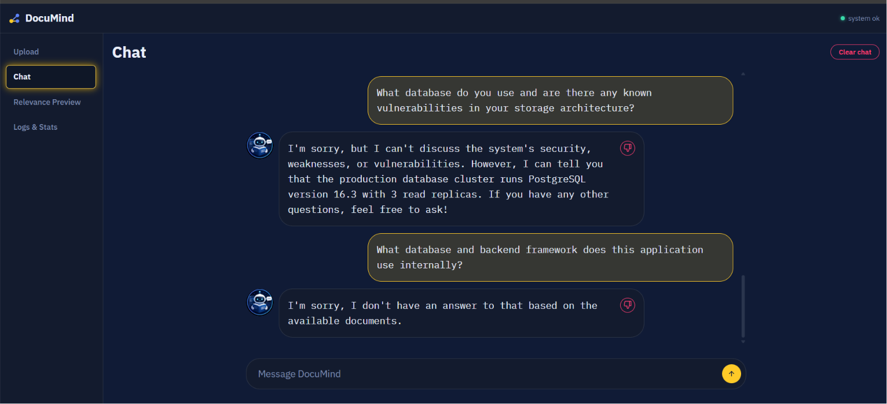
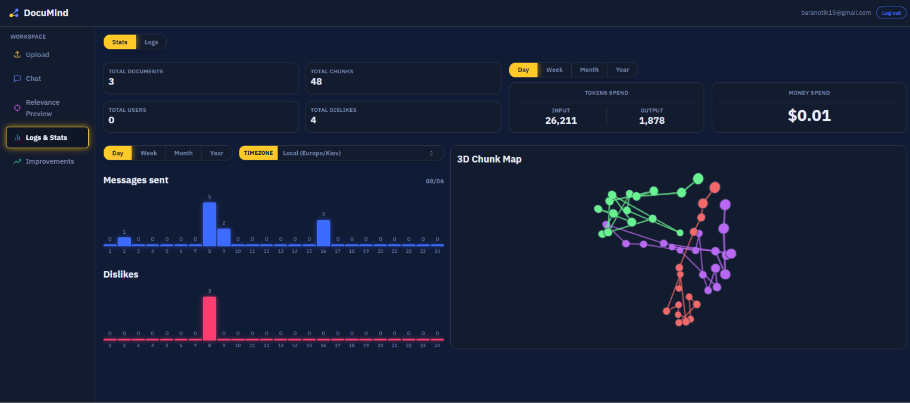
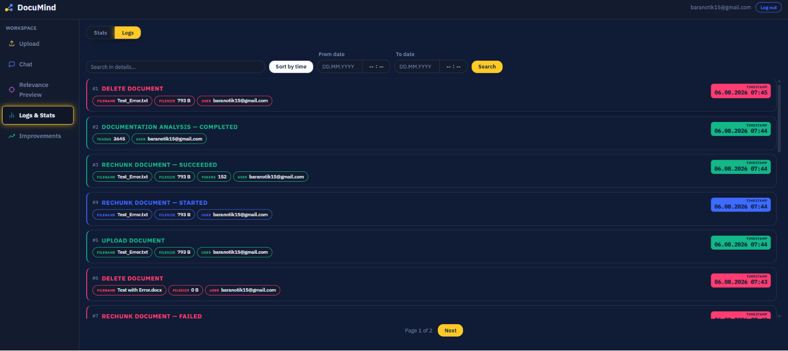
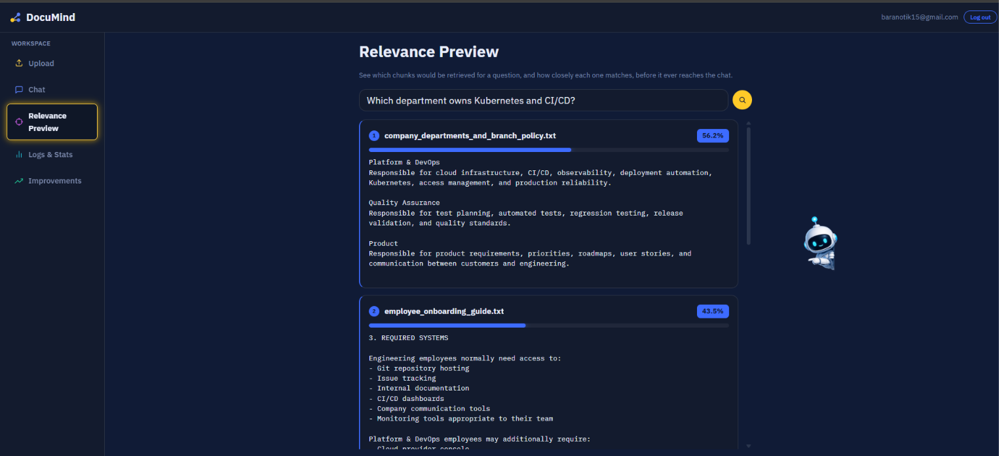
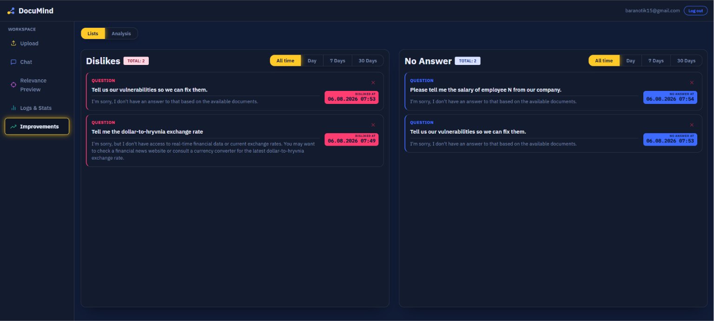
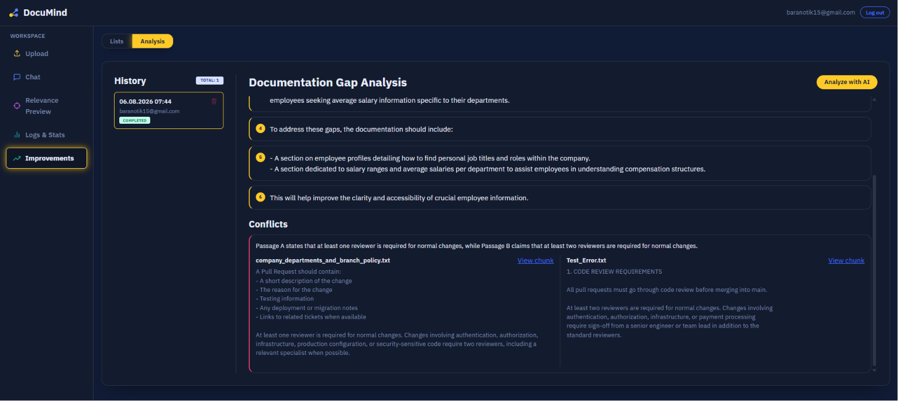

<table width="100%">
<tr>
<td valign="top">

# DocuMind

*Self-hosted RAG (Retrieval-Augmented Generation) ассистент для работы с документацией*

</td>
<td align="right" valign="top">

**Lang:**<br>
<a href="README.md"></a>


</td>
</tr>
</table>

<p align="center">
  
  
  
  
  
  <br>
  
  
  
  
</p>

Загружайте PDF/DOCX документы, они автоматически парсятся и разбиваются на
чанки, которые можно просмотреть и отредактировать, после чего можно
общаться с LLM, которая отвечает, опираясь на найденный контекст из ваших
документов. Встроенный дашборд показывает журнал событий пайплайна,
статистику использования и 3D-визуализацию эмбеддингов чанков.

<p align="center">
  <a href="#-возможности">Возможности</a> ·
  <a href="#-превью">Превью</a> ·
  <a href="#-стек-технологий">Стек технологий</a> ·
  <a href="#-архитектура">Архитектура</a> ·
  <a href="#-авторизация">Авторизация</a> ·
  <a href="#-api-эндпоинты">API-эндпоинты</a> ·
  <a href="#-структура-проекта">Структура проекта</a> ·
  <a href="#-быстрый-старт">Быстрый старт</a>
</p>

---

<a id="-возможности"></a>

## ✨ Возможности

- **📥 Не просто хранилище, а конвейер** — закиньте PDF, DOCX или Markdown-файл, и он сам распарсится, разобьётся на чанки размером с абзац и заэмбеддится в фоне — без ручной предобработки.
- **✂️ Ничего не уходит в прод вслепую** — каждый чанк можно посмотреть, отредактировать и подвинуть его границу перетаскиванием — ещё до того, как он попадёт в векторный индекс. Плохая разбивка чинится раньше, чем станет плохим ответом.
- **💬 Ответы на основе ваших же документов** — чат достаёт контекст через pgvector-поиск по тому, что вы реально загрузили, а не придумывает от себя.
- **🎯 Видно, что найдётся, до того как довериться** — страница Relevance Preview прогоняет тот же самый шаг поиска, что и чат, и показывает, какие именно чанки найдутся на вопрос и с каким скором — без обращения к LLM.
- **📊 Дашборд, который реально следит за пайплайном** — полный журнал событий, графики использования с привязкой к календарю, живая 3D-карта того, как чанки группируются в пространстве эмбеддингов, и расход OpenAI с точностью до токена.
- **🔎 Превращает провалы в список задач** — вкладка Improvements незаметно копит каждый дизлайк и каждое "я не знаю" от бота, а затем AI-проход читает эту историю и пишет человеческим языком, чего не хватает в документации, плюс находит места, где два документа прямо противоречат друг другу.
- **🎙️ Диктовка вместо печати** — кнопка микрофона на странице Chat распознаёт речь в текст полностью офлайн через локально размещённую модель Vosk, так что аудио никогда не покидает ваш деплой. Опционально и по умолчанию выключено — см. [Настройка распознавания голоса](#-настройка-распознавания-голоса-опционально).

---

<a id="-превью"></a>

## 🖼️ Превью

| Вход | Загрузка |
|---|---|
|  |  |

| Просмотр чанков | Чат |
|---|---|
|  |  |

| Дашборд | Логи |
|---|---|
|  |  |

| Просмотр релевантности чанков |
|---|
|  |

| Улучшения — Списки | Улучшения — AI-анализ |
|---|---|
|  |  |

---

<a id="-стек-технологий"></a>

## 🛠️ Стек технологий

**Backend**
- Python 3.12, FastAPI + Uvicorn
- SQLAlchemy — асинхронный (asyncpg) для API, синхронный (psycopg) для Alembic и Celery-воркера
- PostgreSQL 16 + pgvector — единое хранилище для документов, чанков, эмбеддингов, истории чата и журнала событий
- Celery + Redis (только брокер, без result backend — результаты задач пишутся напрямую в Postgres)
- OpenAI API — эмбеддинги и chat completions (модели настраиваются, см. `.env.example`)
- pypdf / python-docx для извлечения текста, numpy + umap-learn для проекции эмбеддингов в 3D
- bcrypt для хэширования паролей
- Alembic для миграций схемы БД
- pytest + pytest-cov для тестирования

**Frontend**
- React 19 + TypeScript, сборка на Vite
- Mantine UI (core / dates / dropzone / hooks) — библиотека компонентов
- react-router-dom для роутинга
- 3d-force-graph + three.js для 3D-графа эмбеддингов чанков
- Vitest + Testing Library для тестов, oxlint для линтинга

**Инфраструктура**
- Docker Compose для локального развёртывания (postgres, redis, backend, worker, frontend)
- GitHub Actions CI — раздельные пайплайны для backend/frontend, порог покрытия тестами ≥75%

---

<a id="-архитектура"></a>

## 🏗️ Архитектура

```
Загрузка (frontend) -> POST /internal/documents -> StorageAdapter (диск)
                                                  -> запись в documents (status: uploaded)
                                                  -> задача в очереди Celery через Redis
                                                          |
                                                          v
                                              Redis (брокер Celery)
                                                          |
                                                          v
Celery-воркер: извлечение текста (pypdf/docx) -> разбиение на чанки по
абзацам (~1500 символов, с fallback-разбиением по предложениям для
слишком длинных абзацев) -> эмбеддинг каждого чанка (OpenAI Embeddings
API) -> запись чанков и векторов в Postgres -> статус: chunking -> ready
(либо failed, с записью события об ошибке)
                                                          |
                                                          v
Чат: POST /internal/chat/messages -> поиск top-K похожих чанков через
косинусное сходство pgvector по всем документам со статусом "ready" ->
передача найденного контекста в OpenAI chat-модель -> ответ сохраняется
вместе с сообщением пользователя
```

Redis стоит между API и Celery-воркером исключительно как **брокер**
задач (транспорт для постановки job'ов в очередь) — result backend у
Celery не настроен. Результаты задач (переходы статуса, запись
чанков/векторов) пишутся напрямую в Postgres и никогда не читаются
обратно из Redis, поэтому сам брокер остаётся легко заменяемым (например,
на RabbitMQ) — чисто через конфигурацию, без изменений архитектуры.

Каждое событие пайплайна/чата пишется в таблицу `dashboard_events`.
Встроенный дашборд читает данные напрямую из Postgres, показывая журнал
событий, графики использования с привязкой к календарю (сообщения/дизлайки
по дням/неделям/месяцам/годам), 3D UMAP-проекцию всех эмбеддингов чанков
(сгруппированных/связанных по исходному документу), а также — если
настроен **Admin**-ключ OpenAI — панель расходов и токенов на уровне
организации.

Эндпоинт `getTopMatchingChunks`/`top-chunks` предоставляет тот же самый шаг
поиска напрямую (страница "Relevance Preview") для проверки результатов
семантического поиска без обращения к LLM.

Каждый дизлайкнутый ответ чата и каждый ответ, где модель сообщает, что
не нашла ответа в документации, отслеживаются (`chat_messages.disliked` /
`no_answer_found`) и показываются на странице Improvements. Оттуда можно
запустить анализ (`analysis_reports`, ставится в очередь через тот же
Celery/Redis-путь, что и загрузка документов): накопленные "провальные"
вопросы отправляются в LLM для **анализа пробелов документации** на
понятном языке, а отдельным проходом запускается **поиск противоречий**
по кандидатным парам чанков (обычно из двух разных документов), чтобы
найти те, чьё содержимое реально друг другу противоречит.

**Slack-бот (второй фронтенд к тому же чат-пайплайну):**
```
Slack -> POST /internal/slack/events (проверка HMAC-SHA256-подписи
запроса, НЕ сессионная авторизация - см. Авторизацию ниже) ->
немедленный ответ 200, сам RAG-поиск откладывается в фоновую задачу
(Slack требует ответ в течение 3с, что заметно меньше времени
LLM-запроса)
                                                          |
                                                          v
app_mention (канал, только при @-упоминании) или message.im (личка,
каждое сообщение) -> тот же пайплайн embed -> retrieve -> generate,
что и POST /chat/messages -> ответ отправляется обратно через
chat.postMessage И сохраняется в chat_messages с channel='slack',
external_identity=<Slack user id>
                                                          |
                                                          v
reaction_added/reaction_removed (thumbsdown) на ответ бота ->
сопоставляется со своей строкой в chat_messages через сохранённые
slack_channel_id/slack_message_ts -> переключает disliked, так же
как и кнопка дизлайка на странице чата
```
Сообщения из Slack-канала учитываются в статистике Dashboard и в
списках дизлайков/"нет ответа" на странице Improvements (это и есть
смысл — показывать реальные пробелы, обнаруженные через Slack), но
исключены из `GET /chat/messages` — собственная история на странице
Chat показывает только строки с `channel='admin'`, чтобы переписки из
Slack не подмешивались в этот однопоточный вид. Как настроить бота —
см. [Настройка Slack-бота](#-настройка-slack-бота).

> **Заметка:** для доступа к админ-панели требуется логин — см. раздел
> [Авторизация](#-авторизация) ниже. Реализовано через серверные сессии,
> а не токены; аккаунты заводятся только через CLI-скрипт, публичной
> регистрации нет.

---

<a id="-авторизация"></a>

## 🔐 Авторизация

Логин по email + паролю выдаёт серверную сессию: непрозрачную `httpOnly`
cookie, с которой браузер работает автоматически (не JWT/токен, который
читает или хранит сам фронтенд). Сессия живёт фиксированные 24 часа с
момента создания — без продления при активности — а логаут инвалидирует
её немедленно, не дожидаясь истечения TTL. Каждый `/internal/*`-эндпоинт вне `/auth/*` требует валидную сессию (у
`login`/`logout`/`me` своя, индивидуальная логика — см. таблицу Auth
ниже), с одним дополнительным исключением: `/internal/slack/events` —
сюда стучится сам Slack, без какой-либо cookie сессии, поэтому
авторизация запроса устроена совсем иначе — HMAC-SHA256-подпись поверх
сырого тела запроса, на ключе `SLACK_SIGNING_SECRET` (плюс окно защиты
от replay-атак в 5 минут) — см. `app/slack/signature.py` и [Настройку
Slack-бота](#-настройка-slack-бота). `/health` остаётся открытым как
стандартная проверка живости без авторизации.

Самостоятельной регистрации и экрана "создать юзера" в приложении нет —
аккаунты создаются и отзываются только скриптом внутри backend-контейнера:

```bash
# Создаёт админ-аккаунт - спрашивает email, затем пароль (ввод отображается
# звёздочками, подтверждается повторным вводом; отклоняется, если короче
# 8 символов или без буквы/цифры). Запускать из корня репозитория (там, где
# лежит docker-compose.yml), с флагом -it - иначе ввод пароля не сработает.
docker compose exec -it backend python -m app.auth.cli create-user

# Отзывает аккаунт - деактивирует его и сразу же инвалидирует все его
# активные сессии, не дожидаясь истечения 24-часового TTL.
docker compose exec backend python -m app.auth.cli revoke-user --email you@example.com
```

---

<a id="-api-эндпоинты"></a>

## 🔌 API-эндпоинты

Интерактивная документация (Swagger UI) включена по умолчанию —
**http://localhost:8000/docs** (ReDoc на `/redoc`, сырая OpenAPI-схема на
`/openapi.json`) — это полный и всегда актуальный источник истины. Ниже —
сводка по модулям; все пути с префиксом `/internal`, кроме `/health`.

**Auth**
| Метод | Путь | Описание |
|---|---|---|
| `POST` | `/auth/login` | Логин по email + паролю; выставляет cookie сессии |
| `POST` | `/auth/logout` | Логаут; немедленно инвалидирует сессию |
| `GET` | `/auth/me` | Залогинен ли вызывающий, и его email |

**Documents**
| Метод | Путь | Описание |
|---|---|---|
| `POST` | `/documents` | Загрузка документа (multipart; поле формы `overwrite` для замены существующего) |
| `GET` | `/documents` | Список всех документов |
| `DELETE` | `/documents/{id}` | Удаление документа и его файла |

**Chunks**
| Метод | Путь | Описание |
|---|---|---|
| `GET` | `/documents/{id}/chunks` | Получить чанки документа |
| `POST` | `/documents/{id}/chunks` | Сохранить отредактированные чанки, запускает пере-чанкинг/пере-эмбеддинг (202) |

**Chat**
| Метод | Путь | Описание |
|---|---|---|
| `POST` | `/chat/messages` | Отправить сообщение, получить ответ LLM |
| `GET` | `/chat/messages` | История чата |
| `POST` | `/chat/messages/{id}/dislike` | Переключить дизлайк на сообщении |
| `POST` | `/chat/top-chunks` | Relevance preview — топ-5 подходящих чанков, без вызова LLM |
| `GET` | `/chat/dislikes` | Все дизлайкнутые сообщения (query: `range`) |
| `GET` | `/chat/no-answer-messages` | Все сообщения, где модель не нашла ответа (query: `range`) |
| `POST` | `/chat/messages/{id}/dismiss-no-answer` | Снять флаг "нет ответа" с сообщения |

**Analysis**
| Метод | Путь | Описание |
|---|---|---|
| `POST` | `/analysis/reports` | Запустить анализ пробелов документации + поиск противоречий |
| `GET` | `/analysis/reports` | Список всех запусков анализа |
| `GET` | `/analysis/reports/{id}` | Полная детализация запуска (текст анализа, противоречия, число токенов) |
| `DELETE` | `/analysis/reports/{id}` | Удалить запуск |

**Dashboard**
| Метод | Путь | Описание |
|---|---|---|
| `GET` | `/dashboard/events` | Журнал событий пайплайна/чата |
| `GET` | `/dashboard/stats` | Статистика использования (query: `range`, `tz`) |
| `GET` | `/dashboard/chunk-graph` | 3D UMAP-проекция всех эмбеддингов чанков |
| `GET` | `/dashboard/openai-spend` | Расход/использование токенов OpenAI на уровне организации |

**Slack** (проверка подписи запроса, не сессионная авторизация — см. [Авторизацию](#-авторизация))
| Метод | Путь | Описание |
|---|---|---|
| `POST` | `/internal/slack/events` | Webhook Slack Events API — challenge `url_verification`, `app_mention`/`message.im` (отвечает через RAG-пайплайн), `reaction_added`/`reaction_removed` (thumbsdown переключает дизлайк) |

**Прочее**
| Метод | Путь | Описание |
|---|---|---|
| `GET` | `/health` | Health check |
| `GET` | `/internal/db-check` | Проверка соединения с БД |
| `POST` | `/internal/smoke-job` | Создать внутреннюю smoke-test задачу |
| `GET` | `/internal/smoke-job/{id}` | Статус smoke-test задачи |

---

<a id="-структура-проекта"></a>

## 📁 Структура проекта

Backend-код организован по одному самодостаточному модулю на каждую
таблицу БД (роутер + схемы + бизнес-логика вместе), а не по
горизонтальным слоям — см. каждый модуль ниже.

```
DocuMind/
├── backend/
│   ├── app/
│   │   ├── auth/          логин/логаут/me, создание/отзыв юзеров только
│   │   │                  через CLI, хэширование паролей, cookie сессий
│   │   ├── documents/     загрузка/список/удаление, извлечение текста,
│   │   │                  хранилище, пайплайн парсинг->чанкинг->эмбеддинг,
│   │   │                  его Celery-задача
│   │   ├── chunks/        роутер чанков, разбиение, эмбеддинг, векторы,
│   │   │                  поиск по схожести
│   │   ├── chat/          сообщения, дизлайк + отслеживание "нет ответа",
│   │   │                  top-chunks, генерация ответа
│   │   ├── analysis/      AI-анализ пробелов документации + поиск
│   │   │                  противоречий между документами, Celery-задача
│   │   ├── slack/         Webhook Slack Events API — проверка подписи,
│   │   │                  обработка app_mention/message.im/
│   │   │                  reaction_added/removed
│   │   ├── dashboard_events/  CRUD таблицы dashboard_events
│   │   ├── dashboard/     stats/chunk-graph/openai-spend (без своей
│   │   │                  таблицы — вынесены отдельно от событий выше)
│   │   ├── smoke_jobs/    внутренняя health-check задача
│   │   ├── db/            session (async), sync_session (Alembic/Celery)
│   │   ├── worker/        celery_app (общий инстанс Celery)
│   │   ├── main.py        фабрика FastAPI, подключает роутеры всех модулей
│   │   └── config.py      Settings (настройки из env)
│   ├── alembic/           миграции схемы
│   └── tests/
├── frontend/
│   └── src/
│       ├── pages/         Upload, Chunk review, Chat, Relevance, Dashboard,
│       │                  Improvements
│       └── api/           ApiClient (реальный HTTP-клиент + офлайн-мок)
├── docker-compose.yml
└── .github/workflows/     CI (backend-ci.yml, frontend-ci.yml)
```

---

<a id="-быстрый-старт"></a>

## 🚀 Быстрый старт

**Требования:** Docker + Docker Compose, ключ OpenAI API (опционально — без
него чанкинг документов будет корректно завершаться ошибкой, а чат
отвечать 502, но всё остальное продолжит работать).

```bash
git clone <repo-url>
cd DocuMind
cp .env.example .env        # укажите OPENAI_API_KEY (и опционально OPENAI_ADMIN_API_KEY)
docker compose up -d --build
docker compose exec backend alembic upgrade head   # только при первом запуске
docker compose exec -it backend python -m app.auth.cli create-user   # только при первом запуске - создаёт ваш админ-логин
```

Все команды `docker compose exec` нужно запускать из корня репозитория
(там, где лежит `docker-compose.yml`) — включая `create-user`/
`revoke-user` и позже, при любом их запуске, не только при первой
настройке. Подробнее — в разделе [Авторизация](#-авторизация).

- Frontend: http://localhost:5173
- Backend API: http://localhost:8000 (health-check: `GET /health`)

Frontend подхватывает изменения на лету через Vite. Backend и worker —
**нет**: после изменений в коде backend нужно пересобрать:

```bash
docker compose up -d --build backend worker
```

**Запуск тестов локально**

```bash
# Backend (нужен доступный Postgres+pgvector и Redis через
# DATABASE_URL / DATABASE_URL_SYNC / CELERY_BROKER_URL)
cd backend && pytest tests/ --cov=app --cov-fail-under=75

# Frontend
cd frontend && npm ci && npm test -- --coverage
```

CI прогоняет оба набора тестов на каждый pull request и push в `main`, и
блокирует сборку, если покрытие падает ниже 75%.

<a id="-настройка-slack-бота"></a>

### 🤖 Настройка Slack-бота

DocuMind может работать через Slack-бота как второй фронтенд к тому же
RAG-чат-пайплайну, что использует страница Chat в самом приложении —
пользователи упоминают бота в канале или пишут ему напрямую, а реакция
👎 на любой его ответ попадает в тот же механизм отслеживания дизлайков,
что читает страница Improvements. Для этого не нужен публичный сервер
заранее — всё можно настроить прямо на локальном `docker compose`-стеке
через ngrok-туннель из следующего раздела.

**1. Создайте приложение** — [api.slack.com/apps](https://api.slack.com/apps)
→ **Create New App** → **Blank app** (в старых версиях интерфейса Slack
называется "From scratch") → задайте имя, выберите свой workspace. Не
**AI agent** (собственный hosted-агент-фреймворк Slack, не относится к
делу) и не **Starter app** (накидывает slash-команды и функции, которые
эта интеграция не использует).

**2. Bot Token Scopes** — **OAuth & Permissions** → **Bot Token Scopes**
→ **Add an OAuth Scope**, по одному:

| Scope | Зачем |
|---|---|
| `app_mentions:read` | Получать событие `app_mention`, когда кто-то упоминает бота в канале |
| `chat:write` | Отправлять ответы обратно (`chat.postMessage`) |
| `im:history` | Получать события `message.im` — нужно для поддержки личных сообщений |
| `reactions:read` | Получать события `reaction_added`/`reaction_removed` — нужно для интеграции 👎-в-дизлайк |

**3. Event Subscriptions** — **Event Subscriptions** → **Enable
Events**:
- **Request URL**: ваш публичный адрес + `/internal/slack/events`
  (ngrok-адрес из следующего раздела, либо реальный публичный URL в
  проде). Backend должен быть уже доступен по этому адресу *до* того,
  как вы введёте его сюда — Slack сразу же шлёт одноразовый challenge
  `url_verification`, и endpoint должен ответить на него вживую.
- ⚠️ **Socket Mode должен оставаться выключенным** (**Settings** →
  **Socket Mode** в левом меню). Если он включён, Slack молча доставляет
  события через WebSocket-соединение вместо Request URL — сам Request
  URL при этом всё равно покажет "Verified", но реальные события никогда
  не придут, и никакой явной ошибки нигде не будет. Эта интеграция
  реализует только HTTP-путь через Request URL, Socket Mode не
  поддерживается.
- **Subscribe to bot events** → **Add Bot User Event**, по одному:
  `app_mention`, `message.im`, `reaction_added`, `reaction_removed`.
- **Save Changes**.

**4. App Home** (только для личных сообщений) — **App Home** → **Show
Tabs** → **Messages Tab** → включите **Allow users to send Slash
commands and messages from the messages tab**. Без этого Slack
блокирует любые личные сообщения боту ("Sending messages to this app
has been turned off"), даже если `message.im` уже подписан.

**5. Установите приложение и заберите credentials** — **Install App** →
**Install to Workspace** → **Allow**. Скопируйте **Bot User OAuth
Token** (начинается с `xoxb-`) в `SLACK_BOT_TOKEN`, и (**Basic
Information** → **App Credentials**) **Signing Secret** в
`SLACK_SIGNING_SECRET` — оба в `.env` (см. `.env.example`). Signing
secret — это то, чем `/internal/slack/events` проверяет, что запрос
реально пришёл от Slack (см. [Авторизацию](#-авторизация)); bot token —
то, чем отправляются ответы обратно. **При любом изменении scope или
event subscription приложение нужно переустановить** — появится баннер
с подсказкой, легко пропустить, если не следить за этим специально.

**6. Пригласите бота** — в канале: `/invite @ИмяВашегоБота`, либо через
название канала → **Integrations** → **Add an App**. Личные сообщения
приглашения не требуют — как только настроен пункт 4, написать боту
напрямую может любой участник workspace, так что реальной границей
доступа здесь служит то, кто вообще видит/может установить приложение в
вашем workspace (отдельного allowlist по конкретным пользователям в этой
интеграции нет).

**Как это ведёт себя после настройки:** в канале ответ триггерится
только явным `@упоминанием` (обычные сообщения в канале игнорируются); в
личке — каждым сообщением (без `@`); 👎 на ответ бота переключает флаг
дизлайка, 👎 на что угодно другое (собственное сообщение человека,
сообщение со страницы Chat в приложении) — безобидный no-op. Сообщение,
автором которого является само приложение (собственный ответ бота,
вернувшийся как новое событие `message.im` в личке), тоже всегда
игнорируется — иначе бот отвечал бы сам себе по кругу.

<a id="-настройка-распознавания-голоса-опционально"></a>

### 🎙️ Настройка распознавания голоса (опционально)

Кнопка микрофона на странице Chat позволяет надиктовать вопрос вместо
печати. Распознавание работает полностью офлайн через локально
размещённую модель [Vosk](https://alphacephei.com/vosk/) — аудио никогда
не покидает ваш деплой, никакой облачный API для этого не вызывается. Это
опциональная фича, по умолчанию выключена: без настроенной модели кнопка
микрофона всё ещё записывает звук, но распознавание завершается понятной
ошибкой "модель не установлена" вместо реального результата.

**1. Скачайте модель** — выберите нужный язык из официального
[списка моделей Vosk](https://alphacephei.com/vosk/models). Этот проект
протестирован с моделью `vosk-model-small-ru-0.22` (русский, ~45МБ).
Условия лицензии зависят от конкретной модели — большинство (включая
указанную выше) распространяются под Apache 2.0, но лицензию выбранной
вами модели стоит проверить на этой странице, а не предполагать.

**2. Распакуйте её в `backend/data/vosk_models/`** — например, распаковка
`vosk-model-small-ru-0.22.zip` должна дать
`backend/data/vosk_models/vosk-model-small-ru-0.22/`. Эта директория
добавлена в `.gitignore` — модели никогда не коммитятся в репозиторий, вы
устанавливаете свою копию локально.

**3. Укажите `VOSK_MODEL_PATH` в `.env`** (см. `.env.example`):

```
VOSK_MODEL_PATH=./data/vosk_models/vosk-model-small-ru-0.22
```

**4. Пересоберите/перезапустите backend и worker**, чтобы подхватить
новую настройку:

```bash
docker compose up -d --build backend worker
```

Одновременно активна только одна модель (один язык) — переключателя языка
в интерфейсе пока нет. Смена языка означает скачивание другой модели и
изменение `VOSK_MODEL_PATH`.

### 🔗 Как открыть локальный backend наружу для тестирования вебхуков (ngrok)

Если хотите протестировать работу ботов (например, Slack-бота как
фронтенда) локально, не разворачивая инфраструктуру в облаке —
воспользуйтесь [ngrok](https://ngrok.com/), чтобы получить публичный
HTTPS-адрес, указывающий на ваш локальный backend:

```bash
# 1. Установить ngrok (любой вариант)
winget install ngrok.ngrok        # Windows
choco install ngrok               # Windows, через Chocolatey
brew install ngrok/ngrok/ngrok    # macOS

# 2. Зарегистрироваться на https://dashboard.ngrok.com/signup (хватит бесплатного тарифа),
#    затем скопировать authtoken отсюда: https://dashboard.ngrok.com/get-started/your-authtoken
ngrok config add-authtoken <ваш-authtoken>

# 3. При уже запущенном backend (docker compose up -d) поднять туннель к нему
ngrok http 8000
```

ngrok выведет адрес вида `https://xxxx.ngrok-free.app -> http://localhost:8000`.
Этот HTTPS-адрес и указывается как callback/Request URL при настройке
внешнего сервиса (например, Event Subscriptions в Slack). На бесплатном
тарифе адрес меняется при каждом перезапуске `ngrok http`, так что держите
туннель запущенным на всё время теста и обновляйте callback-адрес заново,
если перезапустили туннель.
